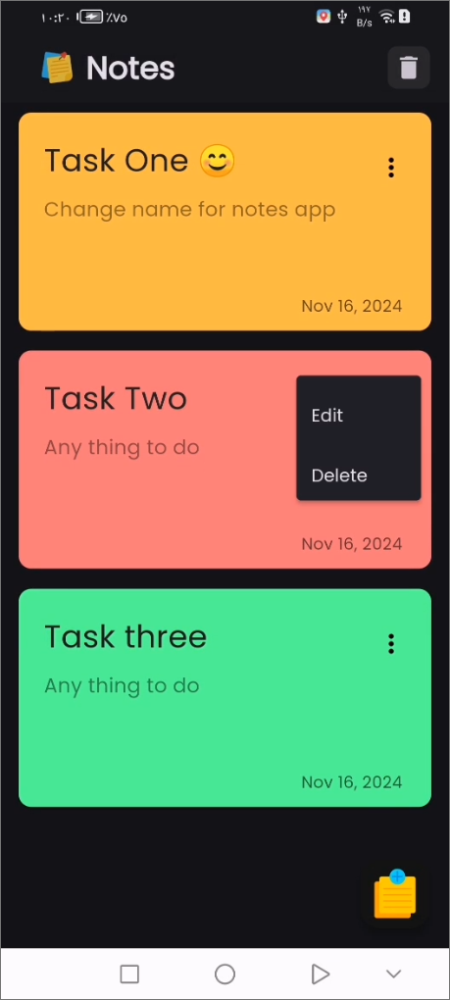
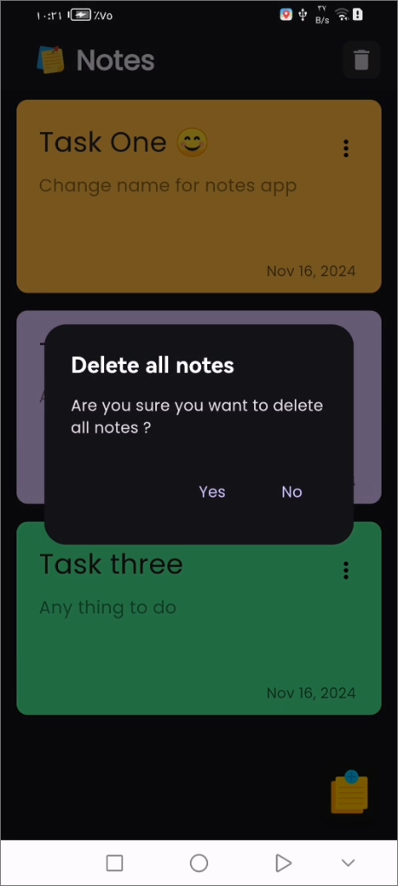

<div align="center">

# *"وَقُلْ رَبِّ زِدْنِي عِلْمًا"*

</div>
<br clear="both">
<a href="https://git.io/typing-svg"></a>
<br clear="both">


This project is a simple **Notes Application** built with **Flutter** and **Hive**, demonstrating the use of **BLoC** for state management. The app allows users to **add**, **edit**, **delete**, and **view notes** efficiently.

[](https://flutter.dev/)
[](https://opensource.org/licenses/MIT)

---


## Features

1. **Add Notes**  
   - Add notes with a title, content, and optional color.
   - Input validation is implemented for both the title and content fields.

2. **View Notes**  
   - Displays a list of all saved notes.
   - If no notes are available, an empty state with a message is shown.

3. **Edit Notes**  
   - Modify the details of existing notes directly from the list.

4. **Delete Notes**  
   - Remove a single note or clear all notes.
   - Confirmation dialogs ensure accidental deletions are avoided.

5. **Persistent Storage**  
   - Uses **Hive** for offline storage, ensuring all notes are saved and retrieved seamlessly.

---

## Project Structure

### Main Components

- **Main Entry (`main.dart`)**: 
  - Initializes Hive, registers adapters, and sets up the BLoC observer.
  - Entry point of the app with a MaterialApp wrapped in a `BlocProvider`.

- **View Notes (`NotesView`)**:
  - Displays the list of notes using a `BlocBuilder`.
  - Provides options for adding or clearing notes via the app bar and FAB.

- **Add Notes (`AddNoteBottomSheet` & `AddNoteForm`)**:
  - A bottom sheet for adding a new note.
  - Includes input validation and form submission.

- **UI Widgets**:
  - `CustomerAppBar`: Customizable app bar.
  - `CustomerListBody`: Displays the list of notes.
  - `CustomerNoListBody`: UI for the empty state when no notes are available.
  - `CustomerNoteItem`: Renders individual note items.

---

## Screenshots

| Splash Screen | Empty Notes Screen | View Notes Screen | Edit Screen |
|---|---|---|---|
|  |  |   |   |

| Bottom Sheet Screen | Add Notes Screen | Added Notes Screen | Dialog Edit Screen | Dialog Edit Screen |
|---|---|---|---|---|
|  |  |   |   |  |

---

## Setup Instructions

### Prerequisites

- Flutter SDK installed.
- `Hive` and `BLoC` packages included in `pubspec.yaml`.
- Development environment (VSCode, Android Studio, etc.).

### Steps to Run

1. **Clone the repository**:  
   ```bash
   git clone <repository-url>
   cd notes-app
   ```

2. **Install dependencies**:  
   ```bash
   flutter pub get
   ```

3. **Run the app**:  
   ```bash
   flutter run
   ```

---

## Packages Used

- **[Flutter BLoC](https://pub.dev/packages/flutter_bloc)**: State management solution.
- **[Hive](https://pub.dev/packages/hive)**: Lightweight and fast database for Flutter.
- **[intl](https://pub.dev/packages/intl)**: Formatting dates.

---

## Folder Structure

```
lib/
├── cubits/
│   ├── add_note_cubit/
│   │   ├── add_note_cubit.dart
│   │   └── add_note_state.dart
│   └── view_note_cubit/
│       ├── view_note_cubit.dart
│       └── view_note_state.dart
├── helper/
│   └── constant.dart
├── models/
│   └── note_model.dart
├── views/
│   ├── notes_view.dart
│   └── widgets/
│       ├── add_note_bottom_sheet.dart
│       ├── add_note_form.dart
│       ├── customer_appbar.dart
│       ├── customer_list_body.dart
│       ├── customer_no_list_body.dart
│       └── customer_note_item.dart
└── main.dart
```

---

## How to Use

1. **Adding Notes**:  
   - Tap the floating action button to open the bottom sheet.
   - Fill in the title and content fields.
   - Tap the "Save" button to add the note.

2. **Viewing Notes**:  
   - All notes appear on the main screen.
   - If no notes exist, a placeholder message will be shown.

3. **Deleting Notes**:  
   - Tap the trash icon on the app bar to clear all notes.

---

## Contributing

Contributions are welcome! Feel free to submit a Pull Request with improvements, bug fixes, or new features.

1. Fork the repository.
2. Create a new branch (`git checkout -b feature/my-feature`).
3. Make your changes and commit (`git commit -am 'Add new feature'`).
4. Push to the branch (`git push origin feature/my-feature`).
5. Create a new Pull Request.

## Congratulations

You’ve successfully integrated Notes App into your Flutter app! For more advanced features and customization options.

If you found this guide helpful, don’t forget to ⭐ star this repository on GitHub to show your support!

Thank you for reading!

## Contact

For any questions or inquiries, feel free to reach out:

- **GitHub:** [mohamedmagdy2301](https://github.com/mohamedmagdy2301)
- **Email:** [mohammedmego15@gmail.com](mohammedmego15@gmail.com)

## License

This project is licensed under the MIT License - see the [LICENSE](LICENSE) file for details.
